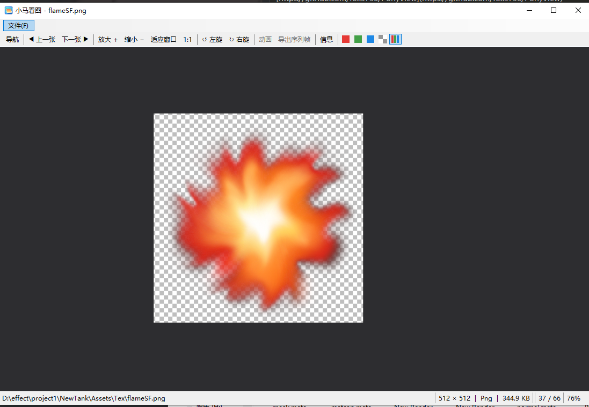
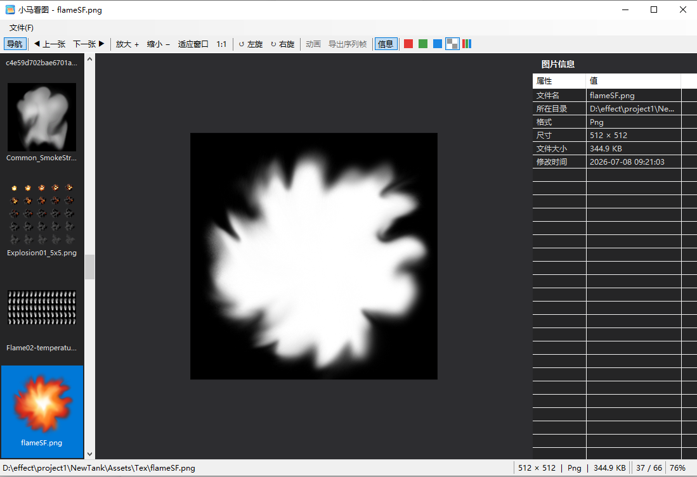

# 小马看图 (PonyView)

一款基于 **.NET 8 WinForms + Magick.NET** 的 Windows 多格式图片查看器。支持 **45 种**图片格式（含 RAW / PSD / HEIC / WebP / AVIF / SVG / JXL 等），具备缩放平移、动态图播放、缩略图导航、元数据信息面板、全屏、格式转换、复制到剪贴板等功能，并针对大图浏览做了 **LRU 缓存 + 引用计数固定 + 相邻预加载 + 全异步解码** 的性能优化。

> 界面语言：简体中文　|　平台：Windows x64　|　许可证：[MIT](LICENSE)

---

## ✨ 功能特性

### 浏览与显示
- **超广格式支持**：45 种格式，涵盖常见图（JPG/PNG/GIF/BMP/WebP）、专业图（PSD/PSB/TGA）、现代图（HEIC/HEIF/AVIF/JXL/QOI）、矢量图（SVG/WMF/EMF）以及主流相机 **RAW**（CR2/CR3/NEF/ARW/DNG/RAF/ORF… 见下方完整清单）。
- **缩放 / 平移 / 旋转**：滚轮缩放、拖拽平移、适应窗口、1:1 实际大小、左右旋转。
- **动态图播放**：GIF 等动图自动播放，可暂停 / 逐帧前进后退。
- **全屏模式**：`F11` 或双击进入 / 退出。
- **图像通道显示**：可切换查看 RGB 等通道。

### 导航与信息
- **缩略图侧栏**：同目录图片缩略图导航，**懒加载**优化，滚动流畅。
- **信息面板**：显示图片尺寸、格式、EXIF / 元数据。
- **相邻预加载**：浏览当前图时后台预解码上一张 / 下一张，切换近乎瞬时。

### 文件操作
- **打开**：文件对话框、**拖拽打开**、命令行 / "打开方式"传入路径。
- **复制图片到剪贴板**：右键菜单 / `Ctrl+C`，可粘贴到其他软件（所见即所得，含当前帧与旋转）。
- **保存 / 另存为 / 格式转换**：静态图转存为多种格式；动态图可导出为 PNG 序列帧。
- **安装时格式关联**：安装向导提供勾选页，列出全部支持格式，勾选的设为默认打开，未勾选的保持不变。

### 性能与健壮性
- **全异步解码**：解码在后台线程进行，大图 / RAW 不卡 UI。
- **LRU 内存缓存 + 引用计数固定**：来回切换命中缓存复用已解码位图；正在显示的图被"固定"绝不会被后台预加载淘汰，从根本上杜绝 `ObjectDisposedException`。
- **过期结果丢弃**：快速连续切换时，用序号丢弃过时的解码结果，避免内存泄漏。

---

## 🖼️ 截图

### 主界面：透明背景 / 工具栏 / 状态栏
打开一张带 Alpha 通道的 PNG，棋盘格表示透明区域；顶部工具栏含导航、缩放、旋转、动画、通道切换，底部状态栏显示尺寸 / 格式 / 大小 / 帧号 / 缩放比。



### 缩略图侧栏 + 元数据信息面板 + 通道显示
左侧为同目录缩略图导航（懒加载），右侧「图片信息」面板列出文件名 / 目录 / 格式 / 尺寸 / 大小 / 修改时间；中间展示 Alpha 通道单通道视图。



---

## ⌨️ 快捷键

| 快捷键 | 功能 | 快捷键 | 功能 |
| --- | --- | --- | --- |
| `Ctrl+O` | 打开文件 | `Ctrl+C` | 复制图片到剪贴板 |
| `Ctrl+S` | 保存 | `Ctrl+Shift+S` | 另存为 |
| `Ctrl+W` | 关闭当前图片 | `F11` / 双击 | 全屏 |
| `←` / `→` | 上一张 / 下一张 | `Space` | 播放 / 暂停动图 |
| `Ctrl+←` / `Ctrl+→` | 逆时针 / 顺时针旋转 90° | `,` / `.` | 上一帧 / 下一帧 |
| `+` / `-` | 放大 / 缩小 | `0` | 适应窗口 |
| `1` | 实际大小 (1:1) | `Esc` | 退出全屏 |

---

## 📁 支持格式（45 种）

```
.jpg  .jpeg .png  .bmp  .gif  .tif  .tiff .ico  .wmf  .emf
.psd  .psb  .tga  .webp .heic .heif .hif  .avif .svg  .svgz
.jxl  .qoi  .dng  .cr2  .cr3  .crw  .nef  .nrw  .arw  .srf
.sr2  .raf  .orf  .pef  .srw  .rw2  .x3f  .rwl  .mef  .mos
.dcr  .kdc  .erf  .mrw  .raw
```

格式解码由 [Magick.NET](https://github.com/dlemstra/Magick.NET)（ImageMagick 的 .NET 封装）提供。

---

## 🛠️ 技术栈

- **.NET 8**（`net8.0-windows`）、**WinForms**、**C#**
- **Magick.NET-Q8-x64** —— 多格式图片解码
- **xUnit** —— 单元测试（见 `WinFormsApp1.Tests/`）
- **Inno Setup** —— 打包为 `setup.exe` 安装程序

---

## 🚀 构建与运行

### 环境要求
- Windows 10/11 **x64**
- [.NET 8 SDK](https://dotnet.microsoft.com/download/dotnet/8.0)
- （可选，仅打包安装程序时需要）[Inno Setup 6](https://jrsoftware.org/isdl.php)

### 编译运行
```powershell
# 还原并编译
dotnet build WinFormsApp1.csproj -c Debug

# 直接运行
dotnet run --project WinFormsApp1.csproj
```

### 运行单元测试
```powershell
dotnet test WinFormsApp1.Tests\WinFormsApp1.Tests.csproj
```

### 发布自包含版本（免装 .NET 运行时）
```powershell
dotnet publish WinFormsApp1.csproj -c Release -r win-x64 --self-contained true -o bin\Publish\win-x64
```

### 打包为安装程序 setup.exe
先安装 Inno Setup 6，然后运行一键脚本（自动完成"发布 + 编译安装包"）：
```powershell
powershell -ExecutionPolicy Bypass -File .\build-installer.ps1
```
产物位于 `bin\Publish\Installer\`。安装向导中可勾选要关联的图片格式。

---

## 📖 项目结构

```
WinFormsApp1/
├── Program.cs              # 程序入口，支持命令行传入图片路径
├── MainForm.cs             # 主窗口：菜单/工具栏/图片区/状态栏/信息面板/缩略图
├── ZoomPanPictureBox.cs    # 缩放平移图片显示控件、动画播放、通道显示
├── DecodedImage.cs         # 解码后的图片模型（帧、延迟、矢量重渲染、所有权）
├── IImageLoader.cs         # 图片加载器接口
├── ImageLoader.cs          # 加载/解码/元数据/缩略图/保存，SupportedExtensions 权威清单
├── ImageCache.cs           # LRU 缓存 + 引用计数固定（Pin/Unpin，Interlocked 原子）
├── InfoPanel.cs            # 元数据信息面板
├── ThumbnailSidebar.cs     # 缩略图侧栏（懒加载）
├── WinFormsApp1.Tests/     # xUnit 单元测试（含 ImageCache 多线程并发测试）
├── installer/              # Inno Setup 打包脚本（.iss）
├── docs/screenshots/       # README 截图
├── build-installer.ps1     # 一键发布 + 打包脚本
├── app.ico                 # 多尺寸应用图标（16/32/48/256）
└── PROJECT_HANDOVER.md     # 架构交接文档（ImageCache 引用计数设计等）
```

核心架构与所有权契约（缓存拥有解码位图、调用方只 Pin/Unpin 不 Dispose）详见 [PROJECT_HANDOVER.md](PROJECT_HANDOVER.md)。

---

## ⚠️ 关于杀毒软件误报（重要）

本程序**未做代码签名**，实测发现：当可执行文件名为**中文**（如 `小马看图.exe`）时，会被 **360** 等国产杀软的启发式引擎误报为 `Trojan.Generic`；将程序集 / exe 文件名改为**英文**（`PonyView.exe`）后，同一套代码即不再报毒。

因此本项目采用：
- **exe / 程序集名 = 英文 `PonyView`**（磁盘上的文件名，规避误报）；
- **用户可见的显示名 = 中文「小马看图」**（窗口标题、安装名、开始菜单、快捷方式等，通过 `MainForm.AppTitle` 与安装脚本 `MyAppName` 设置）。

如果你重新编译后仍遇到误报，可：将 exe 加入杀软信任区、向杀软厂商提交误报申诉，或为程序购买**代码签名证书**（根治方案）。

---

## 📄 许可证

本项目基于 [MIT License](LICENSE) 开源。

## 🙏 致谢

- [Magick.NET](https://github.com/dlemstra/Magick.NET) —— 强大的多格式图片处理库
- [Inno Setup](https://jrsoftware.org/isinfo.php) —— 免费的安装程序制作工具
